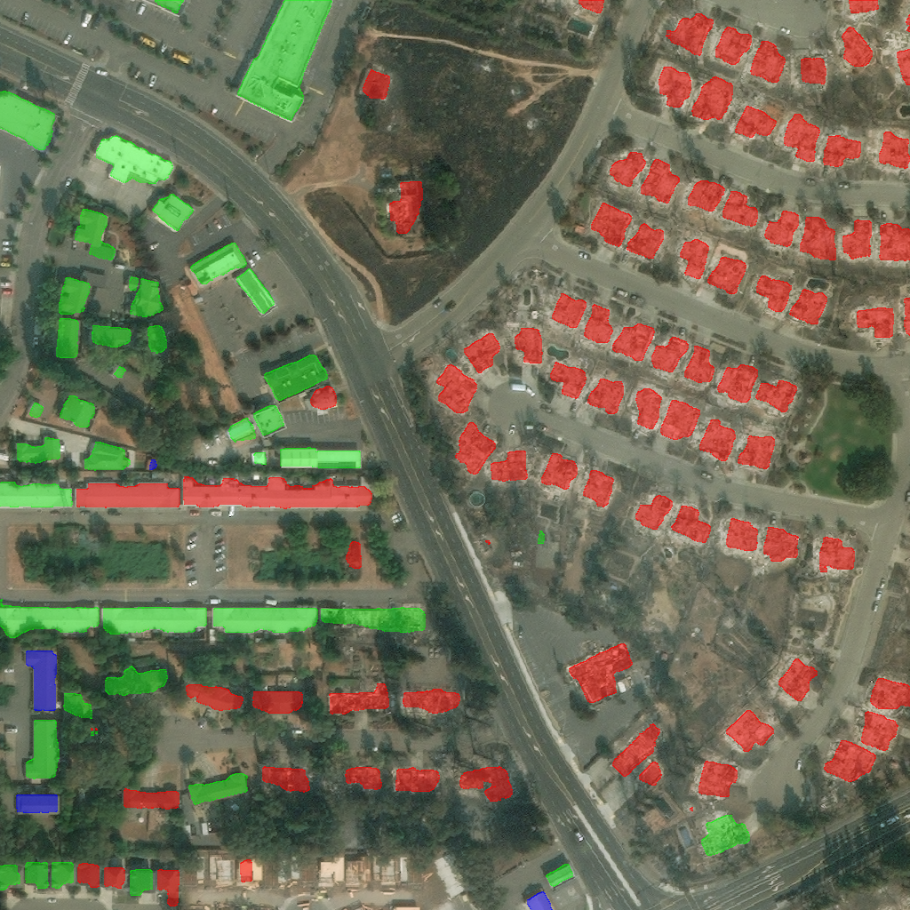

# Overlaying the Submission Format Over Images 

## Release Statement
xview2-baseline

Copyright 2019 Carnegie Mellon University.

THIS SOFTWARE IS PROVIDED BY THE COPYRIGHT HOLDERS AND CONTRIBUTORS "AS IS" AND ANY EXPRESS OR IMPLIED WARRANTIES, INCLUDING, BUT NOT LIMITED TO, THE IMPLIED WARRANTIES OF MERCHANTABILITY AND FITNESS FOR A PARTICULAR PURPOSE ARE DISCLAIMED. IN NO EVENT SHALL THE COPYRIGHT HOLDER OR CONTRIBUTORS BE LIABLE FOR ANY DIRECT, INDIRECT, INCIDENTAL, SPECIAL, EXEMPLARY, OR CONSEQUENTIAL DAMAGES (INCLUDING, BUT NOT LIMITED TO, PROCUREMENT OF SUBSTITUTE GOODS OR SERVICES; LOSS OF USE, DATA, OR PROFITS; OR BUSINESS INTERRUPTION) HOWEVER CAUSED AND ON ANY THEORY OF LIABILITY, WHETHER IN CONTRACT, STRICT LIABILITY, OR TORT (INCLUDING NEGLIGENCE OR OTHERWISE) ARISING IN ANY WAY OUT OF THE USE OF THIS SOFTWARE, EVEN IF ADVISED OF THE POSSIBILITY OF SUCH DAMAGE.

Released under a BSD-3-style license, please see LICENSE.md or contact permission@sei.cmu.edu for full terms.

[DISTRIBUTION STATEMENT A] This material has been approved for public release and unlimited distribution.  Please see Copyright notice for non-US Government use and distribution.

This Software includes and/or makes use of the following Third-Party Software subject to its own license:
1. SpaceNet (https://github.com/motokimura/spacenet_building_detection/blob/master/LICENSE) Copyright 2017 Motoki Kimura.

DM19-0988

## Overview

The xView2 challenge required the solvers to output mask-like images rather than something visual for scoring purpose. Included in this folder is a python program to overlay these outputs from the docker containers on top of the image that was inferred against. 

The output will be a PNG with color coded polygons overlayed onto the image that was given to the containers for inference. The scale is below: 


| Damage Level     | Color         |
| -------------    | ------------- |
| No Damage        | Green         |
| Minor Damage     | Blue          |
| Major Damage     | Orange        |
| Destroyed        | Red           |


Included in this folder is an example of the solver output (`inference_santa-rosa-wildfire_00000007_localization.png` and `inference_santa-rosa-wildfire_0000007_damage.png`) and the image that was the input to the container (`santa-rosa-wildfire_00000007_post_disaster.png`), you can run this as a test against the provided output (`EXAMPLE_santa-rosa-wildfire_00000007_overlay.png`) seen below. 





## Installing

The program requires a few outside libraries (shapely, rasterio, numpy, PIL, etc.) to install these run `pip install -r ./requirments.txt` you'll find the requirements file listed in this folder it has all of the external libraries required and the versions at the time of use. 

## Running

A sample run is given below. 

```
python ./submission_to_overlay_polys.py --image ./santa-rosa-wildfire_00000007_post_disaster.png --localization ./inference_santa-rosa-wildfire_00000007_localization.png --damage ./inference_santa-rosa-wildfire_00000007_damage.png --output ./santa-rosa-wildfire_00000007_overlay.png
```

